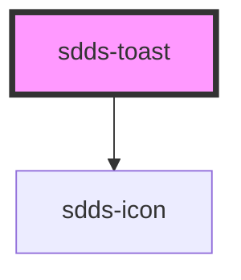

# sdds-toast

<!-- Auto Generated Below -->

## Properties

| Property          | Attribute           | Description                                            | Type                                                 | Default               |
| ----------------- | ------------------- | ------------------------------------------------------ | ---------------------------------------------------- | --------------------- |
| `ariaDescribedBy` | `aria-described-by` | Identifier for the element that describes the toast.   | `string`                                             | `undefined`           |
| `header`          | `header`            | Header text for the component.                         | `string`                                             | `undefined`           |
| `hidden`          | `hidden`            | Hides the toast.                                       | `boolean`                                            | `false`               |
| `role`            | `role`              | ARIA role for the toast.                               | `"alert" \| "log" \| "status"`                       | `'alert'`             |
| `subheader`       | `subheader`         | Subheader text for the component.                      | `string`                                             | `undefined`           |
| `toastId`         | `toast-id`          | ID for the toast. Randomly generated if not specified. | `string`                                             | `crypto.randomUUID()` |
| `type`            | `type`              | Type of toast.                                         | `"error" \| "information" \| "success" \| "warning"` | `'information'`       |

## Events

| Event                  | Description                                      | Type                                |
| ---------------------- | ------------------------------------------------ | ----------------------------------- |
| `sddsToastClosedEvent` | Sends unique toast identifier when it is closed. | `CustomEvent<{ toastId: string; }>` |

## Methods

### `hideToast() => Promise<{ toastId: string; }>`

Hides the toast.

#### Returns

Type: `Promise<{ toastId: string; }>`

### `showToast() => Promise<{ toastId: string; }>`

Shows the toast.

#### Returns

Type: `Promise<{ toastId: string; }>`

## Dependencies

### Depends on

- [sdds-icon](../icon)

### Graph

----------------------------------------------

*Built with [StencilJS](https://stenciljs.com/)*
