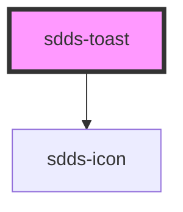

# sdds-toast

<!-- Auto Generated Below -->

## Properties

| Property    | Attribute   | Description                                            | Type                                                 | Default               |
| ----------- | ----------- | ------------------------------------------------------ | ---------------------------------------------------- | --------------------- |
| `header`    | `header`    | Header text for the component.                         | `string`                                             | `undefined`           |
| `show`      | `show`      | Shows the toast if true.                               | `boolean`                                            | `true`                |
| `subheader` | `subheader` | Subheader text for the component.                      | `string`                                             | `undefined`           |
| `toastId`   | `toast-id`  | ID for the toast. Randomly generated if not specified. | `string`                                             | `crypto.randomUUID()` |
| `type`      | `type`      | Type of toast.                                         | `"error" \| "information" \| "success" \| "warning"` | `'information'`       |

## Events

| Event                  | Description                                      | Type                                |
| ---------------------- | ------------------------------------------------ | ----------------------------------- |
| `sddsToastClosedEvent` | Sends unique toast identifier when it is closed. | `CustomEvent<{ toastId: string; }>` |

## Dependencies

### Depends on

- [sdds-icon](../icon)

### Graph

----------------------------------------------

*Built with [StencilJS](https://stenciljs.com/)*
